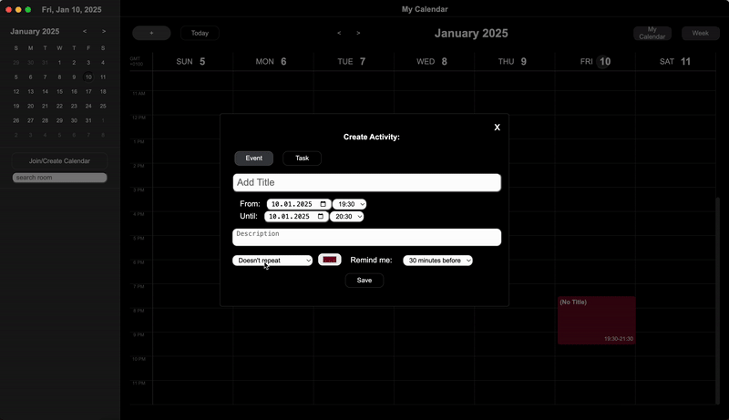

<h1>
  Hey there!  
  <b color="grey" font-size="0.8rem">I'm Geordan</b>
</h1>

  
  
  

  
<!--    -->

  

<b>About What I do</b>  
I'm a professional full-stack developer with a strong focus on scalability, performance, and superb design. I specialize in peer-to-peer (P2P) technologies and AI, and I’m passionate about building efficient, high-quality software that can scale seamlessly. Whether it's developing robust backend systems or crafting intuitive front-end experiences, I’m committed to delivering solutions that are not only functional but also optimized for performance and user experience.  

Feel free to explore my repositories, and let’s connect if you’d like to collaborate!

<h1 align="center">Projects</h1>
<table bordercolor="#66b2b2">
  
  <tr>
    <td width="33%" valign="top">
      <a target="_blank" href="https://github.com/geordangesink/peer-planner-public"><h3 align="center">Peer-Planner</h3></a>
         
        
         
        

          
   
      

        
<strong>Pear, Node.js, React.js, Javascript, CSS, HTML</strong> - Decentralized Calendar Application

    </td>
    <td width="33%" valign="top">
      <a target="_blank" href="https://msp-lab-safety.netlify.app/"><h3 align="center">MSP-lab-safety</h3></a>
         
        
         
        

          
   
  
      

        
<strong>Javascript, CSS, HTML</strong> - Laboratory Safety Education (Interactive safety Video and waste disposal Simulation)

    </td>
    <td width="33%" valign="top">
      <a target="_blank" href="https://wsi.netlify.app/"><h3 align="center">WSI Website</h3></a>
         
      
         
        

          
  <!--  -->
  
      

        
<strong>Javascript, CSS, HTML </strong> - Website and online apperance for Web System Inovations

    </td>
  </tr>

  
  <!--
  <tr>
    <td width="50%" valign="top">
      <h3 align="center">ShawnCharles.com</h3>
       
        
       
        

  
  
      

        
<strong>HTML5, CSS3, & Javascript</strong> - Portfolio Site including links to my projects and ways to get in contact with me.

    </td>
    <td width="50%" valign="top">
      <h3 align="center">Matching Cards</h3>
         
        
         
        

          
  
  
      

        
<strong>HTML5, CSS3, & Javascript</strong> - With over 100 different cards, test your memory in these three popular trading card themes, Pokemon, Yugioh, & Magic: The Gathering!

    </td>
  </tr>
  -->

  
</table>

<h1 align="center">Technologies</h1>

    
    
    
    
    
    
    
    
    
    
    
    
    
    
    

---

<h1 align="center">Connect</h1>

  
  
  
  
<!--    
  

-->

