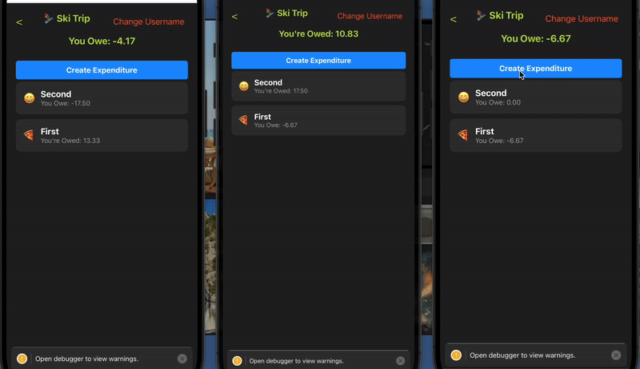

<h1>
  Hey there!  
  <b color="grey" font-size="0.8rem">I'm Geordan</b>
</h1>

  
  
  

  

<b>About What I do</b>  
I'm a professional full-stack developer with a strong focus on scalability, performance, and superb design. I specialize in peer-to-peer (P2P) technologies and AI, and I’m passionate about building efficient, high-quality software that can scale seamlessly. Whether it's developing robust backend systems or crafting intuitive front-end experiences, I’m committed to delivering solutions that are not only functional but also optimized for performance and user experience.  

Feel free to explore my repositories, and let’s connect if you’d like to collaborate!

<h1 align="center">Projects</h1>
<table bordercolor="#66b2b2">
  
  <tr>
    <td width="50%" valign="top">
      <a target="_blank" href="https://github.com/geordangesink/owe-no"><h3 align="center">OweNo</h3></a>
         
        
         
        

          
   
      

        
<strong>Bare, Expo, React Native, Typescript, Javascript</strong> - Decentralized Debt Management Application

    </td>
    <td width="50%" valign="top">
      <a target="_blank" href="https://github.com/geordangesink/peer-planner-public"><h3 align="center">PeerPlanner</h3></a>
         
        
         
        

          
   
      

        
<strong>Pear, Node, React, Javascript, CSS, HTML</strong> - Decentralized Calendar Application

    </td>
    </tr>
  <tr>
    <td width="50%" valign="top">
      <a target="_blank" href="https://msp-lab-safety.netlify.app/"><h3 align="center">MSP-lab-safety</h3></a>
         
        
         
        

          
   
  
      

        
<strong>Vanilla Javascript, CSS, HTML</strong> - Laboratory Safety Education (Interactive safety Video and waste disposal Simulation)

    </td>
    <td width="50%" valign="top">
      <a target="_blank" href="https://wsi.netlify.app/"><h3 align="center">WSI Website</h3></a>
         
      
         
        

          

  
      

        
<strong>Vanilla Javascript, CSS, HTML </strong> - Website and online apperance for Web System Inovations

    </td>
  </tr>

  
</table>

<h1 align="center">Technologies</h1>

    

---

<h1 align="center">Connect</h1>

  
  
  
  

